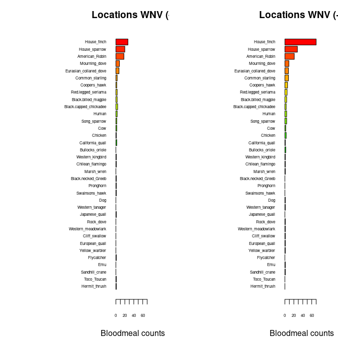

Warm-up mini-Report: Mosquito Blood Hosts in Salt Lake City, Utah
================
Darcey Ferguson
10/1/25

- [**ABSTRACT**](#abstract)
- [**BACKGROUND**](#background)
- [**STUDY QUESTIONS and HYPOTHESIS**](#study-questions-and-hypothesis)
  - [**Questions**](#questions)
  - [**Hypothesis**](#hypothesis)
  - [**Prediction**](#prediction)
- [**METHODS**](#methods)
- [**Bar Plot Visualization**](#bar-plot-visualization)
  - [**Interpretation of Bar Plot
    Visualization**](#interpretation-of-bar-plot-visualization)
- [**Generalized Linear Modeling**](#generalized-linear-modeling)
  - [**Interpretation of GLM**](#interpretation-of-glm)
- [**DISCUSSION**](#discussion)
- [**CONCLUSION**](#conclusion)
- [**REFERENCES**](#references)

# **ABSTRACT**

West Nile Virus is changing the health of more than 1000 individuals per
year. This disease is spread from host animals and mosquitos. From
previous data we suspect that the house finch is an important host
animal being able to keep viremia in system for a long period of time.
If the House finches are acting as important amplifying hosts of WNV in
Salt Lake City then we will see more blood meal counts in our mosquito
data of House finches because there will be more mosquitos carrying the
WNV to and from the House finches. We found a signifiance between house
finches and having WNV as well as the location showing an impact of WNV
mosquitos that bit house finches.

# **BACKGROUND**

West Nile Virus (WNV) is a disease spread by many different animals and
insects. The most common form of transport is through a mosquito to a
host. Then the host spreads the disease further to other animals. This
is important to study because this disease causes fever, headache, body
aches, vomiting, diarrhea, or rashes. (Centers for Disease Control and
Prevention, 2025) Knowing the disastrous nature of this disease, we are
using our best events to prevent the spreading. Our first question was
what specific host animals are most receptive to the WNV. From the bar
plot below we can see that house finch among other animals is one of the
species that keeps viremia of WNV in their system the longest. (Kumar et
al., 2003) This information provides us with key insight that certain
animals are better vessels for carrying the WNV. Being in Utah where
house finches are very prevalent it is better for us to focus on them as
a key host for spreading WNV. (Utah Natural Heritage Program, 2019) In
this experiment we hope to study house finches as a key amplifying host
of WNV in Salt Lake City.

``` r
# Manually transcribe duration (mean, lo, hi) from the last table column
duration <- data.frame(
  Bird = c("Canada Goose","Mallard", 
           "American Kestrel","Northern Bobwhite",
           "Japanese Quail","Ring-necked Pheasant",
           "American Coot","Killdeer",
           "Ring-billed Gull","Mourning Dove",
           "Rock Dove","Monk Parakeet",
           "Budgerigar","Great Horned Owl",
           "Northern Flicker","Blue Jay",
           "Black-billed Magpie","American Crow",
           "Fish Crow","American Robin",
           "European Starling","Red-winged Blackbird",
           "Common Grackle","House Finch","House Sparrow"),
  mean = c(4.0,4.0,4.5,4.0,1.3,3.7,4.0,4.5,5.5,3.7,3.2,2.7,1.7,6.0,4.0,
           4.0,5.0,3.8,5.0,4.5,3.2,3.0,3.3,6.0,4.5),
  lo   = c(3,4,4,3,0,3,4,4,4,3,3,1,0,6,3,
           3,5,3,4,4,3,3,3,5,2),
  hi   = c(5,4,5,5,4,4,4,5,7,4,4,4,4,6,5,
           5,5,5,7,5,4,3,4,7,6)
)

# Choose some colors
cols <- c(rainbow(30)[c(10:29,1:5)])  # rainbow colors

# horizontal barplot
par(mar=c(5,12,2,2))  # wider left margin for names
bp <- barplot(duration$mean, horiz=TRUE, names.arg=duration$Bird,
              las=1, col=cols, xlab="Days of detectable viremia", xlim=c(0,7))

# add error bars
arrows(duration$lo, bp, duration$hi, bp,
       angle=90, code=3, length=0.05, col="black", xpd=TRUE)
```


# **STUDY QUESTIONS and HYPOTHESIS**

## **Questions**

What bird species is acting as WNV amplifying host?

## **Hypothesis**

If the House finches are acting as important amplifying hosts of WNV in
Salt Lake City then we will see more blood meal counts in our mosquito
data of House finches because there will be more mosquitoes carrying the
WNV to and from the House finches.

## **Prediction**

If the House Finch is an important amplifying host, then we will predict
that trapped mosquitoes that feed on the House Finch with have higher
rates of confirmed WNV in the mosquito groups we tested.

# **METHODS**

**Source of Birds and Mosquitoes**

Birds from Salt Lake City area were the main target for the mosquitoes
that we collected in our analysis.

**Capture of Mosquitos**

Box traps that lure mosquitoes in and then trap them were placed at
certain places around Salt Lake city.

**Evaluation of Mosquitoes’ Blood**

Once the mosquitoes were collected we put each into a microtube. Then
using sterilt techniques we crushed the mosquito to release the blood
from the mosquitoes body. The blood belonging to the host it extracted
it from if it is a female mosquito. The mosquito was further isolated
until only the host animal DNA was left. The blood was sequenced using
PCR and DNA sequencing. Next the DNA sequences were put through the
system known as BLAST to identify the blood with the species of animal
that the blood was extracted from.

**West Nile Virus Examination**

The blood from bird hosts were also assessed to find if it possesses
WNV. The data was collected into a database and processed in R Studio.

**Analysis Methods**

The data was plotted in a bar plot to examine how each of the host birds
had WNV and how long that WNV was examines in the bird. The other
analysis was a generalized linear regression used to determine
correlation between the location of the mosquitoes collected and the WNV
being examined in that area. We used statistical tests to determined the
statistical significance from each of the data.

# **Bar Plot Visualization**

Barplots of blood meal ID by trap locations with/without WNV positive
mosquito pools

``` r
## import counts_matrix: data.frame with column 'loc_positives' (0/1) and host columns 'host_*'
counts_matrix <- read.csv("./bloodmeal_plusWNV_for_BIOL3070.csv")

## 1) Identify host columns
host_cols <- grep("^host_", names(counts_matrix), value = TRUE)

if (length(host_cols) == 0) {
  stop("No columns matching '^host_' were found in counts_matrix.")
}

## 2) Ensure loc_positives is present and has both levels 0 and 1 where possible
counts_matrix$loc_positives <- factor(counts_matrix$loc_positives, levels = c(0, 1))

## 3) Aggregate host counts by loc_positives
agg <- stats::aggregate(
  counts_matrix[, host_cols, drop = FALSE],
  by = list(loc_positives = counts_matrix$loc_positives),
  FUN = function(x) sum(as.numeric(x), na.rm = TRUE)
)

## make sure both rows exist; if one is missing, add a zero row
need_levels <- setdiff(levels(counts_matrix$loc_positives), as.character(agg$loc_positives))
if (length(need_levels)) {
  zero_row <- as.list(rep(0, length(host_cols)))
  names(zero_row) <- host_cols
  for (lv in need_levels) {
    agg <- rbind(agg, c(lv, zero_row))
  }
  ## restore proper type
  agg$loc_positives <- factor(agg$loc_positives, levels = c("0","1"))
  ## coerce numeric host cols (they may have become character after rbind)
  for (hc in host_cols) agg[[hc]] <- as.numeric(agg[[hc]])
  agg <- agg[order(agg$loc_positives), , drop = FALSE]
}

## 4) Decide species order (overall abundance, descending)
overall <- colSums(agg[, host_cols, drop = FALSE], na.rm = TRUE)
host_order <- names(sort(overall, decreasing = TRUE))
species_labels <- rev(sub("^host_", "", host_order))  # nicer labels

## 5) Build count vectors for each panel in the SAME order
counts0 <- rev(as.numeric(agg[agg$loc_positives == 0, host_order, drop = TRUE]))
counts1 <- rev(as.numeric(agg[agg$loc_positives == 1, host_order, drop = TRUE]))

## 6) Colors: reuse your existing 'cols' if it exists and is long enough; otherwise generate
if (exists("cols") && length(cols) >= length(host_order)) {
  species_colors <- setNames(cols[seq_along(host_order)], species_labels)
} else {
  species_colors <- setNames(rainbow(length(host_order) + 10)[seq_along(host_order)], species_labels)
}

## 7) Shared x-limit for comparability
xmax <- max(c(counts0, counts1), na.rm = TRUE)
xmax <- if (is.finite(xmax)) xmax else 1
xlim_use <- c(0, xmax * 1.08)

## 8) Plot: two horizontal barplots with identical order and colors
op <- par(mfrow = c(1, 2),
          mar = c(4, 12, 3, 2),  # big left margin for species names
          xaxs = "i")           # a bit tighter axis padding

## Panel A: No WNV detected (loc_positives = 0)
barplot(height = counts0,
        names.arg = species_labels, 
        cex.names = .5,
        cex.axis = .5,
        col = rev(unname(species_colors[species_labels])),
        horiz = TRUE,
        las = 1,
        xlab = "Bloodmeal counts",
        main = "Locations WNV (-)",
        xlim = xlim_use)

## Panel B: WNV detected (loc_positives = 1)
barplot(height = counts1,
        names.arg = species_labels, 
        cex.names = .5,
        cex.axis = .5,
        col = rev(unname(species_colors[species_labels])),
        horiz = TRUE,
        las = 1,
        xlab = "Bloodmeal counts",
        main = "Locations WNV (+)",
        xlim = xlim_use)
```



``` r
par(op)

## Keep the colors mapping for reuse elsewhere
host_species_colors <- species_colors
```

## **Interpretation of Bar Plot Visualization**

This bar plot is of how blood meal counts varied from bird species’
blood meals we collected and the WNV presence. The chart on the left
shows birds blood meals we collected with no WNV and the right the bird
bloods meals with WNV. We saw a significant amount of house finches
having a blood meal that contained WNV. This could be due to the
abundance of the house finch and the possibility that the house finch is
a good amplifier host of WNV. One limitation to this data is not being
able to examine birds on a wider scale. We were limited to the Salt Lake
City area. This has an impact on how our data could be applied to other
places because we do not have a wider spread data set. Overall though we
see a significant change in the house finches in Salt Lake City area
having a lot of blood meals that contained WNV in our study.

# **Generalized Linear Modeling**

Generalized linear modeling regression of house finches’ blood meals
containing WNV compared to the location that the mosquitoes were
collected from.

``` r
#glm with house finch alone against binary +/_
glm1 <- glm(loc_positives ~ host_House_finch,
            data = counts_matrix,
            family = binomial)
summary(glm1)
```

    ## 
    ## Call:
    ## glm(formula = loc_positives ~ host_House_finch, family = binomial, 
    ##     data = counts_matrix)
    ## 
    ## Coefficients:
    ##                  Estimate Std. Error z value Pr(>|z|)  
    ## (Intercept)       -0.1709     0.1053  -1.622   0.1047  
    ## host_House_finch   0.3468     0.1586   2.187   0.0287 *
    ## ---
    ## Signif. codes:  0 '***' 0.001 '**' 0.01 '*' 0.05 '.' 0.1 ' ' 1
    ## 
    ## (Dispersion parameter for binomial family taken to be 1)
    ## 
    ##     Null deviance: 546.67  on 394  degrees of freedom
    ## Residual deviance: 539.69  on 393  degrees of freedom
    ## AIC: 543.69
    ## 
    ## Number of Fisher Scoring iterations: 4

``` r
#glm with house-finch alone against positivity rate
glm2 <- glm(loc_rate ~ host_House_finch,
            data = counts_matrix)
summary(glm2)
```

    ## 
    ## Call:
    ## glm(formula = loc_rate ~ host_House_finch, data = counts_matrix)
    ## 
    ## Coefficients:
    ##                  Estimate Std. Error t value Pr(>|t|)    
    ## (Intercept)      0.054861   0.006755   8.122 6.07e-15 ***
    ## host_House_finch 0.027479   0.006662   4.125 4.54e-05 ***
    ## ---
    ## Signif. codes:  0 '***' 0.001 '**' 0.01 '*' 0.05 '.' 0.1 ' ' 1
    ## 
    ## (Dispersion parameter for gaussian family taken to be 0.01689032)
    ## 
    ##     Null deviance: 6.8915  on 392  degrees of freedom
    ## Residual deviance: 6.6041  on 391  degrees of freedom
    ##   (2 observations deleted due to missingness)
    ## AIC: -484.56
    ## 
    ## Number of Fisher Scoring iterations: 2

## **Interpretation of GLM**

We examined the correlation between the location the house finch blood
meals with WNV were collected and the location of where the mosquitoes
with the blood meals were collected. We saw a statistically significant
correlation between the location the blood meal of the house finch was
collected from and the containing of WNV in the blood meal. This means
that there is association between WNV house finches and the location of
the house finches are at. The limitation of this study is that there are
not traps very abundantly throughout the area. Meaning we don’t have a
narrowed down location to where we are collecting these WNV blood meals.
However, there is still significance in where the blood meal from the
house finch is collected and whether the blood meal contains WNV or not.

# **DISCUSSION**

The bar plot showed statistical significance in the amount of blood
meals collected of house finches containing more often containing WNV
compared to the other species of birds that blood meals were collected
from. Even though the data was swayed towards the house finches because
they are more prevelant we still see a large amount more containing WNV
compared to the ones that do not. Then the generalized linear regression
model had statistical significance in showing the amount of house
finches containing WNV compared to the location they were collected
from. This shows how not only do house finches have more WNV than other
birds, but house finches whose blood from mosquitoes were collected in a
certain area also contained more WNV. This shows us how the species of
bird and location of blood meals collected from bird species plays an
impact on the blood meals containing WNV. This could mean that there are
certain properties in the house finch or in a certain location that
causes WNV to be more able to be spread at that location. Even due to
the limitations of the data not containing a very large variety of birds
and being not very standardized on conditions mosquitoes are collected
in, we still can not deny the correlation between house finches and
there location when it comes to the spread of WNV.

# **CONCLUSION**

We can accurately theorize that house finch are an important amplifier
of WNV in the Salt Lake City Population. We can do this because in our
bar plots we saw a significant amount of more blood meals from the house
finch containing WNV compared to all the other species of birds we
collected blood meals from. This expands our knowledge of how WNV is
spread and how there are specific virus bird hosts that are better at
spreading the WNV compared to other species of bird hosts. We can use
this information to be able and create a way to decrease the spread of
WNV in house finches. We could increase the resilience of house finches
by introducing GMOs into the population. We could develop more
treatments that we give to house finches directly to stop the increase
spread of WNV. There are so many solutions that we can now develop to
stop the spread of this disease because we can target a new source of
amplification host of house finches.

# **REFERENCES**

1.  Komar N, Langevin S, Hinten S, Nemeth N, Edwards E, Hettler D, Davis
    B, Bowen R, Bunning M. Experimental infection of North American
    birds with the New York 1999 strain of West Nile virus. Emerg Infect
    Dis. 2003 Mar;9(3):311-22. <https://doi.org/10.3201/eid0903.020628>

2.  ChatGPT. OpenAI, version Jan 2025. Used as a reference for functions
    such as plot() and to correct syntax errors. Accessed 2025-11-20.

3.  Centers for Disease Control and Prevention. (n.d.). About West Nile.
    Centers for Disease Control and Prevention.
    <https://www.cdc.gov/west-nile-virus/about/index.html>

4.  Centers for Disease Control and Prevention. (n.d.-b). Historic Data
    (1999-2024). Centers for Disease Control and Prevention.
    <https://www.cdc.gov/west-nile-virus/data-maps/historic-data.html>

5.  Utah Natural Heritage Program. Species database - Utah Natural
    Heritage Program Field Guide. (n.d.).
    <https://fieldguide.wildlife.utah.gov/?species=haemorhous+mexicanus#>:~:text=The%20house%20finch%2C%20Carpodacus%20mexicanus,or%20five%20eggs%20are%20laid.
